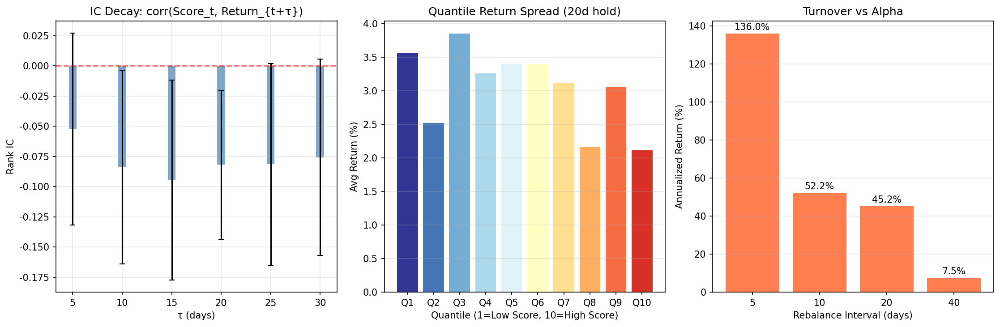

# Stock Strategy - A-Share Stock Screening & Backtesting System

A multi-factor stock screening and backtesting system for A-share markets (Shanghai/Shenzhen).

## Features

- **Data Download**: Downloads daily OHLCV data using akshare
- **Multi-Factor Scoring**: 6-factor model with momentum, volatility, volume ratio, turnover stability, PVT, CLV
- **Backtesting**: Rolling K strategy with configurable parameters
- **Analysis**: IC decay, quantile returns, turnover sensitivity

## Project Structure

```
filter/
├── methods/
│   └── download.py       # Data download using akshare
├── score_model.py        # Multi-factor scoring model
├── backtest.py           # Rolling K strategy backtest
├── analysis.py           # IC, Quantile, Turnover analysis
├── cache/
│   ├── stock_daily/      # Downloaded stock CSV files
│   └── stock_list.csv    # Stock code/name list
└── report/
    ├── score_ranking_*.csv   # Ranking reports
    ├── backtest_result_*.csv # Backtest results
    └── analysis_report.png   # Analysis figures
```

## Installation

```bash
pip install akshare pandas numpy matplotlib
```

## Usage

### 1. Download Stock Data

```bash
python -m filter.methods.download
```

### 2. Generate Score Rankings

```bash
python -m filter.score_model
```

### 3. Run Backtest

```bash
python -m filter.backtest
```

### 4. Run Analysis

```bash
python -m filter.analysis
```

## Configuration

Parameters in `filter/score_model.py`:

| Parameter | Default | Description |
|-----------|---------|-------------|
| MIN_TURNOVER_AMOUNT | 50,000,000 | Minimum turnover (CNY) |
| MAX_TURNOVER_PCT | 15% | Maximum turnover rate |
| MIN_STOCK_LIFE_DAYS | 90 | Minimum stock listing days |
| W1-W6 | (0.25, 0.15, 0.15, 0.15, 0.15, 0.15) | Factor weights |

Parameters in `filter/backtest.py`:

| Parameter | Default | Description |
|-----------|---------|-------------|
| BUY_PCT | 5% | Top N% to buy |
| N_LAYERS | 4 | Number of staggered layers |
| LAYER_HOLD_DAYS | 20 | Holding period per layer |
| INTERVAL_DAYS | 5 | Trading days between rounds |

## Factors

1. **Momentum** (W1=0.25): 20-day + 40-day return
2. **Volatility** (W2=0.15): 15-day standard deviation (inverted)
3. **Volume Ratio** (W3=0.15): 10-day average volume / 60-day average volume
4. **Turnover Stability** (W4=0.15): 20-day turnover standard deviation (inverted)
5. **PVT** (W5=0.15): Price Volume Trend
6. **CLV** (W6=0.15): Close Location Value

All factors are winsorized (1%-99%) and z-score normalized before weighted sum.

## Filters

- 成交额 (Turnover Amount) > 50,000,000 CNY
- 换手率 (Turnover Rate) < 15%
- 上市天数 (Stock Life) > 90 days

## Backtest Results (Latest Run - Staggered Layers)

- **Total Return**: +44.32%
- **Annualized Return**: 110.79%
- **Rounds Completed**: 19/20
- **Total Trades**: 2085

## Analysis Results

### 1. IC Decay (Rank IC)

| τ (days) | Rank IC | Std |
|----------|---------|-----|
| 5 | -0.0439 | 0.1009 |
| 10 | -0.0474 | 0.0821 |
| 15 | -0.0461 | 0.0793 |
| 20 | -0.0636 | 0.0765 |
| 25 | -0.0591 | 0.0628 |
| 30 | -0.0535 | 0.0693 |

**Note**: The negative IC suggests the score has an inverse relationship with future returns. This may indicate the model is capturing mean-reversion behavior rather than momentum. Further investigation needed.

### 2. Quantile Return Spread (20-day hold)

| Quantile | Avg Return |
|----------|-------------|
| Q1 (Low) | +2.03% |
| Q2 | +2.97% |
| Q3 | +2.19% |
| Q4 | +3.24% |
| Q5 | +2.62% |
| Q6 | +2.18% |
| Q7 | +2.73% |
| Q8 | +3.21% |
| Q9 | +1.63% |
| Q10 (High) | +2.79% |

**Q10 - Q1 Spread**: +0.76%

The quantile returns show a general upward trend from Q1 to Q10, indicating that higher-scoring stocks tend to outperform, though the relationship is not perfectly monotonic.

### 3. Turnover vs Alpha

| Rebalance Interval | Annualized Return |
|-------------------|------------------|
| 5 days | 126.62% |
| 10 days | 77.58% |
| 20 days | 75.58% |
| 40 days | 25.29% |

**Analysis**: The 10-day and 20-day intervals show more stable returns (~75-78%), while the 5-day interval shows higher returns but with more turnover. The 40-day interval shows significantly lower returns, suggesting too long holding period loses alpha.



## Data Source

- [akshare](https://akshare.akfamily.xyz/) - A-share stock data
